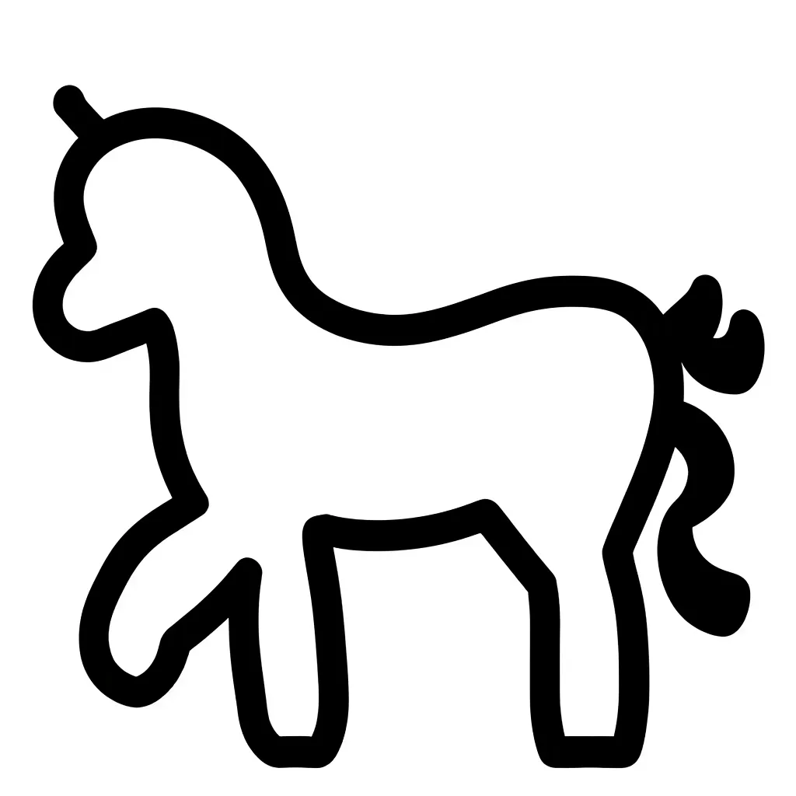
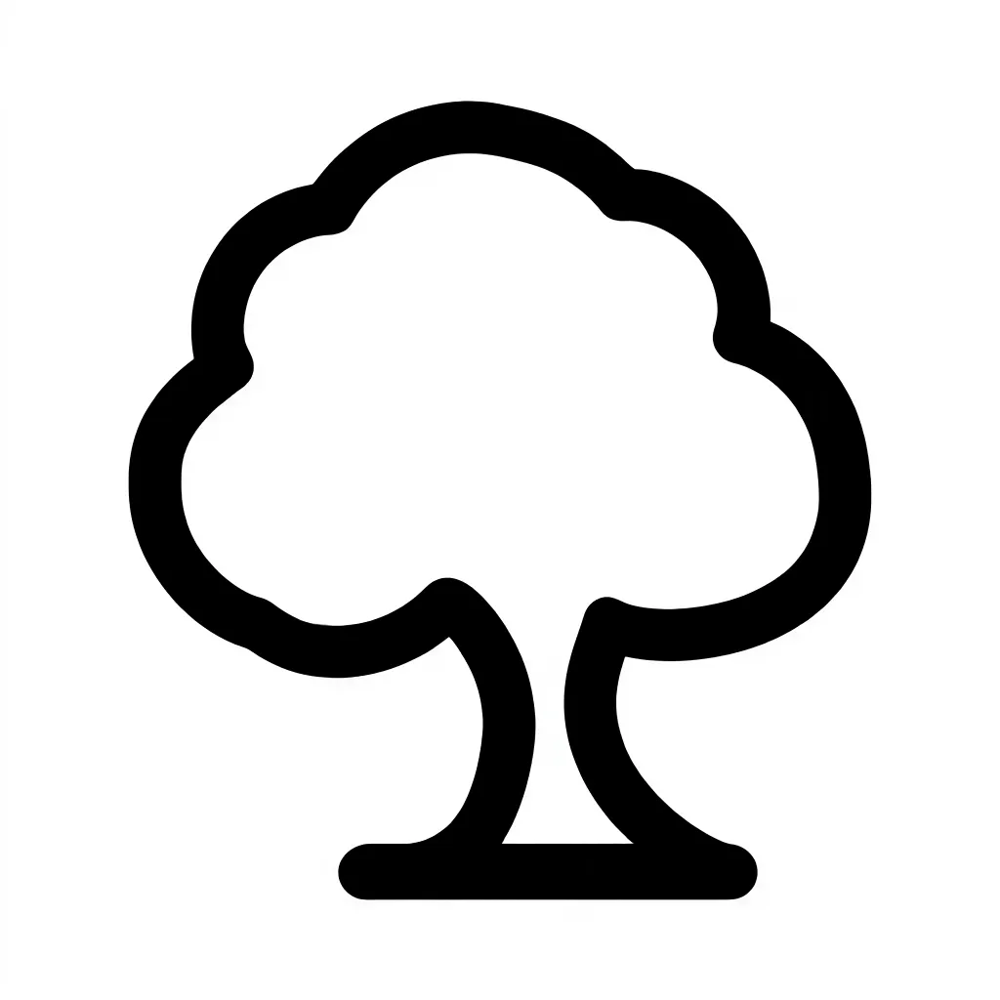
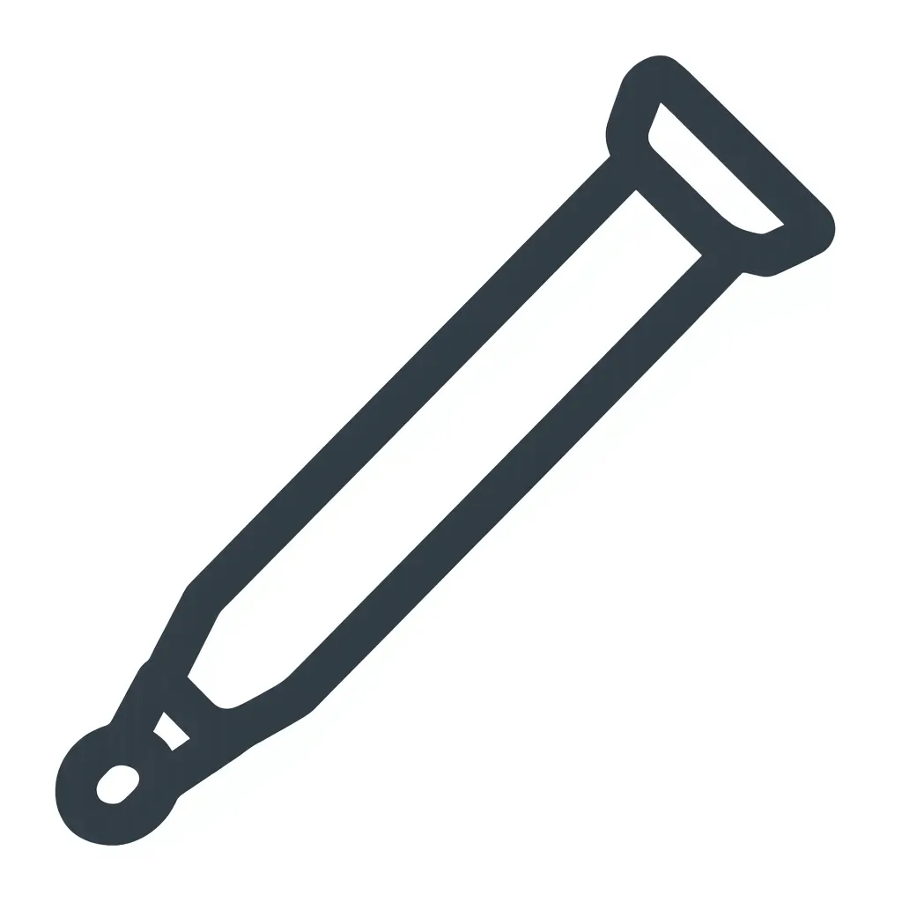

# Questions to answer:

## 1. Complete this table
- No need to answer because of insufficient computational funds

## 2. Why might lower ranks produce noisier outputs?
- forcing the model to use a lower rank might result in the details getting lost because the model needs to oversimplify complex attributes which leads to potentially blurry/noisy outputs.

## 3. What signs indicate your model is overfitting?
- Overfitting can lead to the model learning the noise instead of the patterns present in the data. A potential sign that the model is overfitted is, that irrelevant of the input prompt, the output resembles the training data exactly, even if the prompt should generate a different type of image.

## 4. How would you adapt these settings for a different style (e.g., photorealistic portraits)?
- I have noticed completing the previous task (Exercise 2) that using a negative prompt improves the image output drastically. If the taks is now to output a photorealistic style image based on the model previously fine tuned for icon output, a negative prompt that ignores typical "icon styling" could maybe result in the model ignoring these features which could output a more photorealistic style of image.

- While testing the fine tuned model I noticed that when the prompt is not exactly following the order that it was trained on ("an HCON, in the style of x") the output was not an Icon in many instances. This could be taken advantage of when trying to generate a different style of image. 

# Icon results:

## Prompt: An HCON, a black and white icon of a horse

## Prompt: An HCON, a black and white icon of a tree

## Prompt: An HCON, a black and white icon of a house

## Prompt: An HCON, a black and white icon of a micropipette

## Conclusion:
- Some of the icons turned out relatively realistic, like the tree, while some of them showed some obvious defects like the "house" where there are people in the background of the image, or the "micropipette", which all of the sudden turned out grey instead of black and white.
